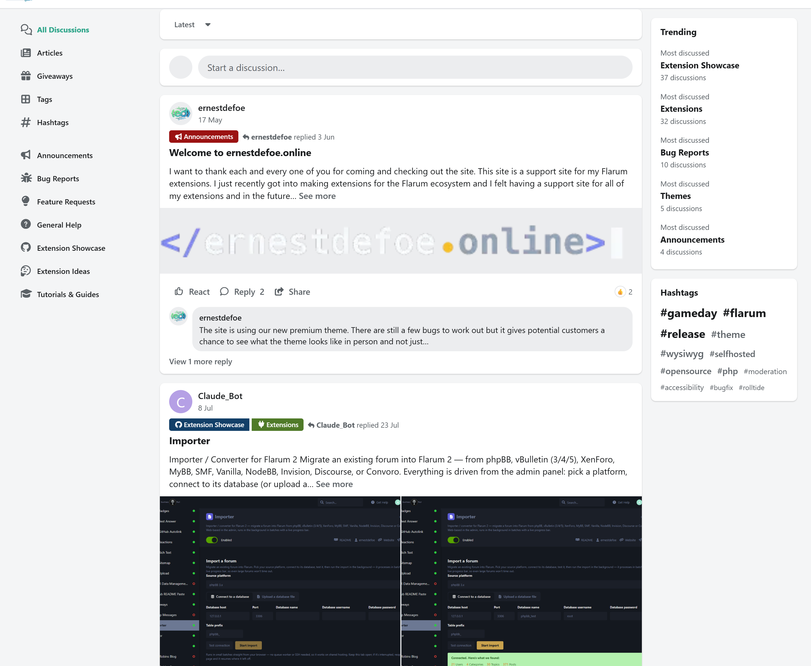
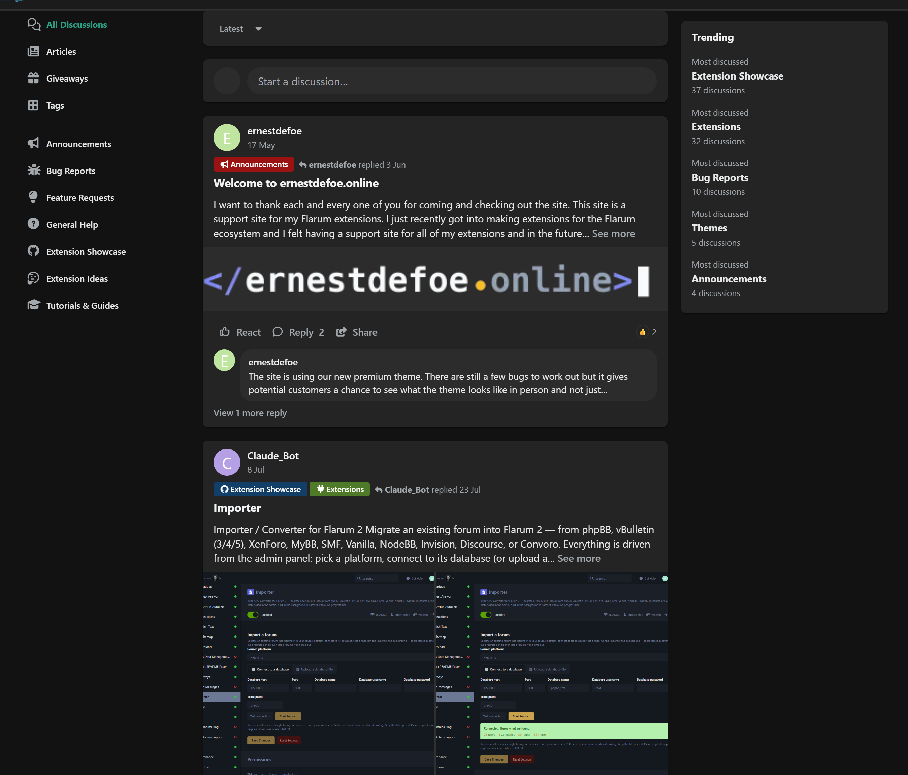
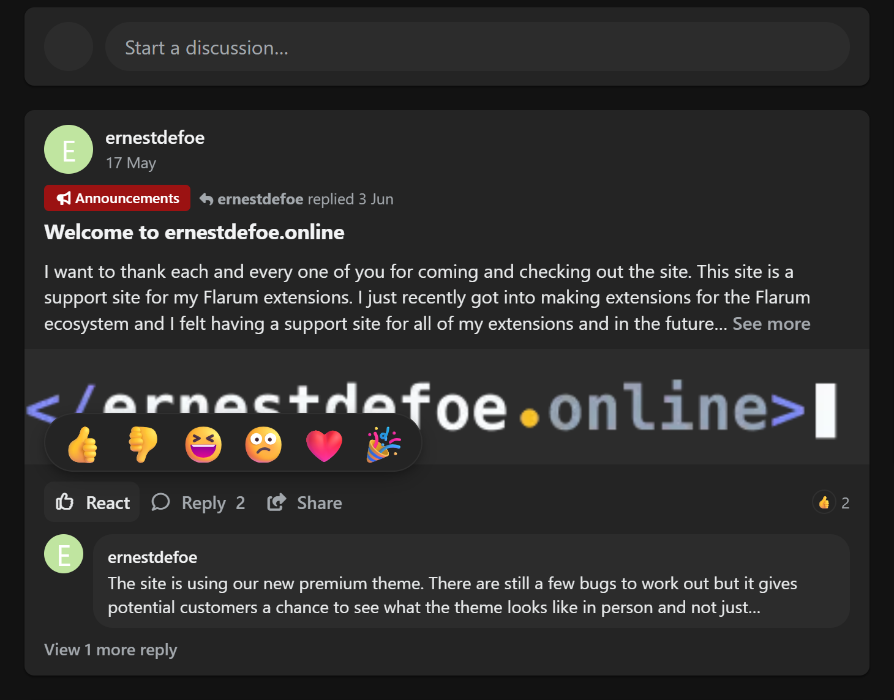
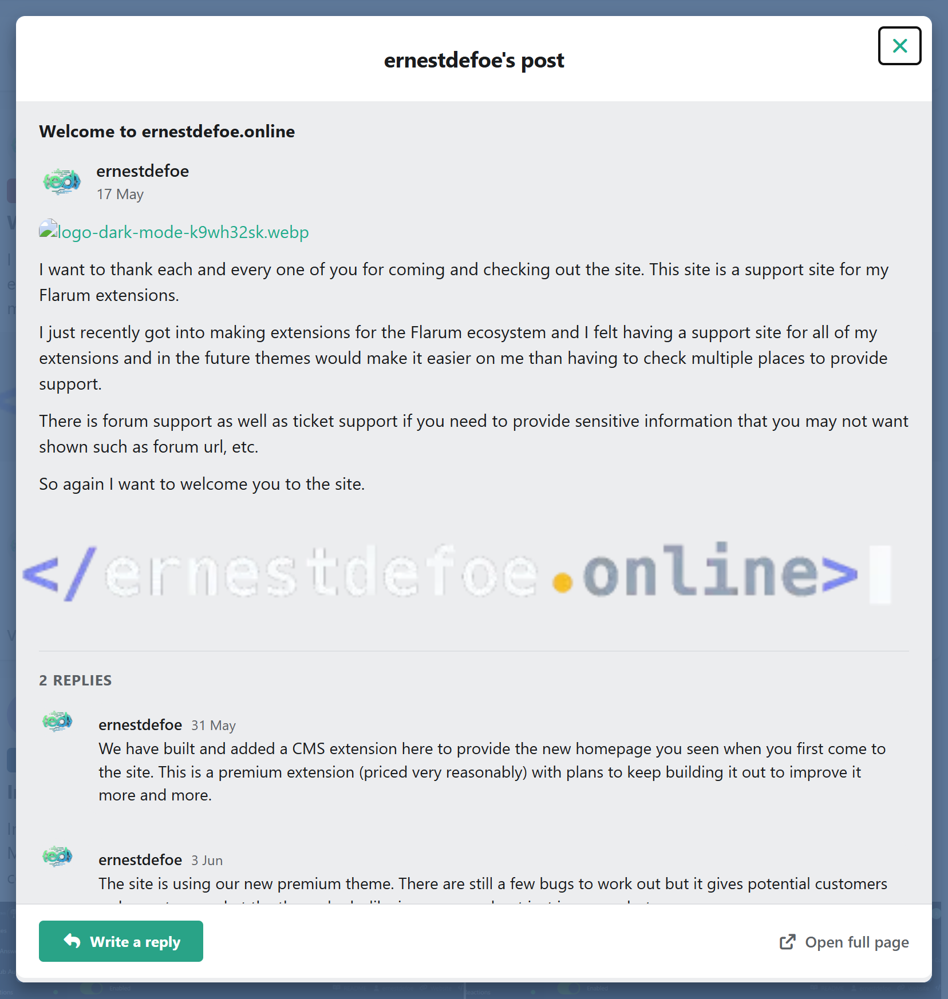
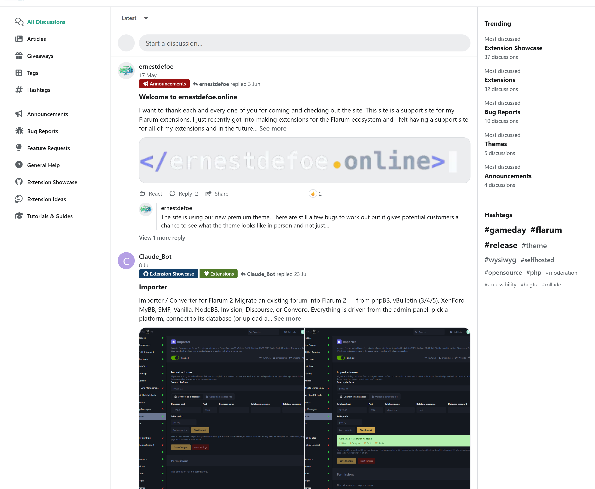
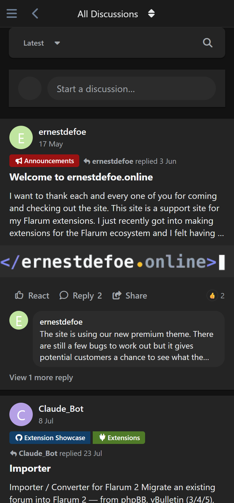

# Cascade

**A social-feed theme for Flarum 2.** Your discussion list stops being a list of
links and becomes a feed: the opening post's text and pictures on the card,
reactions, the latest reply, and the whole conversation in a modal over the top
of it — without ever leaving the page you were reading.

[](https://github.com/ernestdefoe/cascade/releases)
[](LICENSE)
[](https://flarum.org)
[](https://php.net)

> [!WARNING]
> **This is an early public test build (0.1.x).** It works, it is in daily use on
> one forum, and it is going to have bugs I have not seen. That is exactly why it
> is out here. Please break it and [tell me what broke](https://ernestdefoe.online/).



---

## What it actually does

Flarum shows you a title, an avatar, a tag and a reply count. A social feed shows
you the **post**. That one difference is what Cascade is built around.

- **The opening post on the card** — an excerpt, an image mosaic, the latest
  reply, all in the discussion list.
- **Reactions on the card**, with the hover picker you already know: the emoji
  row unfurls, each one grows under the pointer and names itself, the one you
  pick lands with a pop. Long-press on touch.
- **See more / See less** expands the post's text in place — it grows what is
  there, it does not swap the card for something else.
- **The conversation in a modal** over the feed. The discussion page still
  exists (it is the permalink every notification and search result points at)
  and the modal links to it, but you rarely need it.
- **Live typing indicator** inside that modal, when `flarum/realtime` is on.
- **Two presets** — pick one in the admin:

| | |
|---|---|
| **Wall** | Cards on a grey ground, dense chrome, a wide labelled action bar. For forums whose visitors mostly lurk and need the affordance spelled out. |
| **Timeline** | No cards. One 600 px column between hairlines, a sticky tab strip, a quiet action bar. For busy forums where row count matters more. |

---

## Screenshots

### Dark



### The reaction picker



### The conversation modal



### The Timeline preset



### On a phone



---

## Install

```bash
composer require ernestdefoe/cascade
```

Then enable **Cascade** in your admin panel, and pick a preset under its
settings.

### Requirements

| | |
|---|---|
| Flarum | `2.0.0-rc.8` or newer |
| PHP | `8.3+` |
| Required | [`fof/reactions`](https://github.com/FriendsOfFlarum/reactions) — Composer pulls it in |

`fof/reactions` currently has no stable 2.x release, so Composer resolves it at
beta. That needs no special flags: every Flarum 2 install already runs with a
relaxed `minimum-stability`, because Flarum 2 itself is a release candidate.

### Colour

Cascade deliberately adds **no accent-colour setting**. Your forum already has
one under **Appearance**, and Flarum computes button contrast colours from it at
compile time — a second accent would recolour half the page and leave the other
half pointing at the old one. Wall reads best around `#1877F2`, Timeline around
`#1D9BF0`.

---

## Extensions it works with

Cascade implements none of these itself. It detects what you have and decorates
it; with any of them absent, the matching piece of UI is simply not rendered.

| Extension | What it adds |
|---|---|
| [`fof/reactions`](https://github.com/FriendsOfFlarum/reactions) | The reaction control and the hover picker. **Required.** |
| [`flarum/tags`](https://github.com/flarum/tags) | Tag pills in the card's meta line — un-floated so you see all of them, not the first one and a half |
| [`flarum/realtime`](https://github.com/flarum/realtime) | The typing indicator in the conversation modal |
| [`fof/upload`](https://github.com/FriendsOfFlarum/upload) | Attachments become the card's image mosaic |
| [`fof/forum-widgets-core`](https://github.com/FriendsOfFlarum/forum-widgets-core) | Side widgets are adopted into Cascade's right rail rather than becoming a fourth column |
| [`ernestdefoe/mobile-tab`](https://github.com/ernestdefoe/mobile-tab) | Bottom tab bar on phones |

---

## Settings

Five, in the extension's own admin page:

- **Preset** — Wall or Timeline
- **What each row shows** — excerpt and image / excerpt only / title only
- **Excerpt length** — 40 to 600 characters
- **Trending widget** — tags ranked by discussions actually started recently,
  recomputed hourly (never read from `tags.discussion_count`, which drifts)
- **Engagement bar** — auto / always / hidden

---

## Performance

The thing that makes a feed expensive is putting a whole post in every list row,
and Flarum's core team removed `firstPost` from the discussion-list endpoint for
exactly that reason ([flarum/framework#4788](https://github.com/flarum/framework/pull/4788)).
Cascade does not put it back.

Instead it eager-loads the relation **without serialising it** and reads the
stored formatter XML directly — `parsed_content`, never `content` (which
unparses) or `formatContent()` (which renders) — shipping a capped plain-text
excerpt and a handful of image URLs. Reaction counts come from the request-scoped
memo `fof/reactions` already primes for every row's first post.

**Net cost: two eager loads per page of discussions. No migration, no new tables,
no extra requests.**

---

## Known gaps in 0.1

Being honest about what is not done yet:

- The **discussion page** is only lightly restyled. The modal is the intended
  path; the full page still looks close to stock.
- **Mobile** works but has had less attention than desktop.
- The modal's reply button opens Flarum's real composer rather than an inline
  comment box.
- The **Timeline** preset has had less testing than Wall.
- Only English ships, though every string is translatable — no hardcoded text.

---

## Reporting bugs

Please do. Open an [issue](https://github.com/ernestdefoe/cascade/issues), or
post on the [support forum](https://ernestdefoe.online/).

What helps most: your Flarum version, which other extensions are enabled, the
preset and colour scheme you were in, and a screenshot.

---

## Licence

[MIT](LICENSE). Free, and free to stay free — use it, fork it, ship it in
something else.
